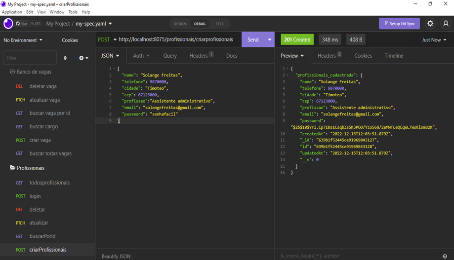
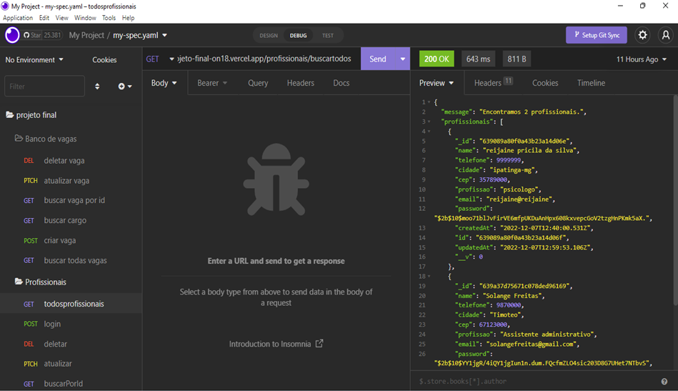
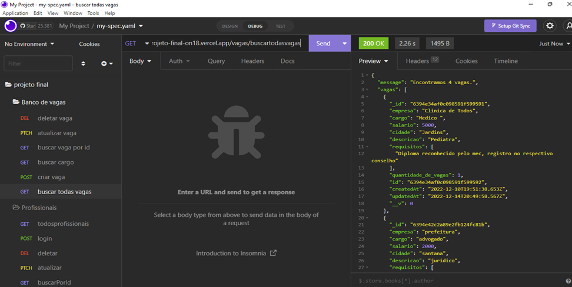

Nome Projeto
Insira-se.

Tema
Insira-se é um banco de vagas para a inserção de recém formados no mercado de trabalho.

Justificativa
A ideia desse projeto veio de uma vivência pessoal, estou formada a quase 7 anos e não consegui ser inserida no mercado de trabalho, pois toda porta que batia exigia experiência, hoje soma-se mais de 15% de brasileiros que não consegue ser inserido no mercado de trabalho com sua respectiva  graduação.No curso TODAS EM TECH da {reprograma} vi uma oportunidade de criar um site de banco de vagas para profissionais que desejam cadastrar as vagas e profissionais que desejam buscar as vagas com preferências de recém formados.


🔧  ARQUITETURA MVC
```
 📁PROJETO FINAL
   |-  📂node_modules
   |-  📁 src
   |    |
   |    |- 📁 config
   |         |- 📑 database.js

   |    |- 📁 controllers
   |         |- 📑 bancoDeVagasController.js
   |         |- 📑 profissionaisController.js
   |
   |    |- 📁 middlewares
   |         |- 📑 auth.js
   |
   |    |- 📁 models
   |         |- 📑bancoDeVagasSchema.js
   |         |- 📑ProfissionaisSchema.js
   |
   |    |- 📁 routes
   |         |- 📑bancoDeVagasRoutes.js 
   |         |- 📑indexRoutes.js
   |         |- 📑profissionaisRoutes.js 
   |     
   |
   |    |- 📑 app.js
   |    
   |
   |
   |- 📑 .env
   |- 📑 .gitignore
   |- 📑 package-lock.json
   |- 📑 package.json
   |- 📑 README.me
   |- 📑 server.js
   |- 📑 vercel.json


1º Passo - Clonar o repositório

 Clone este projeto para sua máquina local.

git clone https://github.com/reijaine/Projeto_Final_On18

2º Passo - Instalar as dependências
Para instalar as dependências do projeto, digite o comando no terminal:

npm i

3º Passo - Configurar o ambiente
No arquivo .env colocar as informações correspondentes a sua máquina e incluindo os valores para PORT com a porta, MONGO_URI com a URL do MongoDb e SECRET com o secret.

4º Passo - Executar a aplicação
Com a aplicação clonada e as dependências configurações basta rodar a aplicação com o comando no terminal:

npm start

# 🔃 ROTAS
   
## 🔃 ROTAS- PROFISSIONAIS

| Método HTTP  | Endpoint              | Descrição                                  |
| ------------ | --------------------- | ------------------------------------------ |
| GET          | `/profissionais/buscartodos`         | Busca todos os profissionais cadastrados    
| GET          | `/profissionais/buscarporid:/id       | Busca todos os profissionais cadastrados por
id           |
| POST        | `/profissionais/criarprofissionais   | Cadastro dos profissionais   
| POST        | `/profissionais/login   | Login dos usuarios           |
| PATCH     | `/profissionais/atualizar/:Id       | Atualizar o cadastro dos profissionais           |
| DELETE          | `profissionais/delete/:id`     | Deletar um cadastro por ID  |


## 🔃 ROTAS - VAGAS

| Método HTTP  | Endpoint              | Descrição                                  |
| ------------ | --------------------- | ------------------------------------------ |
| GET          | `/vagas/buscartodasvagas`         | Buscar todas os vagas cadastradas    
| GET          | `/vagas/buscarvaga:/id       | Buscar todas as vagas por id   
| GET          | `/vagas/buscarcargo      | Buscar vaga por cargo        
| POST        | `/vagas/criarvagas   | Cadastro das vagas   
| PATCH     | `/vagas/atualizarvaga/:id      | Atualizar o cadastro das vagas      
| DELETE          | `vagas/delete/:id`     | Deletar uma vaga por ID  |

## 👨‍💻Tecnologias e pacotes utilizados neste projeto

Tecnologias :

JavaScript
Git/Github
Node.js
MongoDb
MongoDBatlas
Insomnia
Vscode


Pacotes Utilizados

Express
Nodemon
dotenv
Mongoose
cors
nodemon

<br>

---


# ✔️VISUALIZAÇÃO E FUNCIONAMENTO:


<br>

>Criar profissionais
<div align = "center">


</div>
<br>


<br>

>Listando todos os profissionais cadastrados
<div align = "center">


</div>
<br>
<br>
<br>

>Buscar todas vagas
<div align = "center">


</div>
<br>


<br>

>Criar vagas 
<div align = "center">


</div>
<br>
<br>
link vercel:
https://reijaine-pricila-projeto-final-on18.vercel.app/

link apresentação:
https://docs.google.com/presentation/d/1FTiCzeedBNFI9pdoXciuueXWuSnWvjXS/edit?usp=share_link&ouid=100375705286170213897&rtpof=true&sd=true

AGRADECIMENTOS
Primeiramente quero agradecer a Deus, pela oportunidade de estar concluindo  mais uma etapa na minha vida e início de uma trajetória na programação, grata a {reprograma} por me proporcionar um momento único, um ambiente seguro e prazeroso de muita aprendizagem.

 AUTORA
Meu nome é Reijaine Pricila sou formada em psicologia, em transição de carreira para o desenvolvimento back-end.

CONTATO
GITHUB: https://github.com/reijaine
LINKEDIN: https://www.linkedin.com/in/reijaine-pricila-4a00a8124/
PORTIFOLIO: https://meek-dusk-4c8595.netlify.app/index.html
CURRICULO: https://drive.google.com/drive/folders/1edjbu5fhr99QC23YZX0DXaSdmgb3B3eZ
